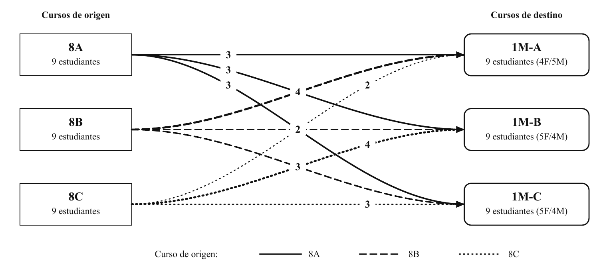

# Análisis de sensibilidad de los pesos

## Alcance

Se resolvió siete veces la misma instancia sintética de 27 estudiantes. Solo se
modificaron `lambda_0` y `lambda_1`; los datos y restricciones permanecieron
constantes. Las preferencias son blandas y la formulación es la suma ponderada
del modelo vigente.

Se define

\[
U=|S|-\sum_i z_i,
\qquad
Z=\lambda_0U+\lambda_1T.
\]

`U` es el número de estudiantes sin al menos una preferencia satisfecha y `T`
es la máxima dispersión entre los tres criterios de perfil.

## Resultados verificados

| Escenario | `lambda_0` | `lambda_1` | Satisfechos | `U` | `T` | `Z` |
|---|---:|---:|---:|---:|---:|---:|
| Balance 10:1 | 0.10 | 1.00 | 24/27 | 3 | 2.6667 | 2.9667 |
| Balance 4:1 | 0.25 | 1.00 | 24/27 | 3 | 2.6667 | 3.4167 |
| Balance 2:1 | 0.50 | 1.00 | 24/27 | 3 | 2.6667 | 4.1667 |
| Base del draft | 1.00 | 1.00 | 26/27 | 1 | 4.6667 | 5.6667 |
| Preferencias 2:1 | 1.00 | 0.50 | 27/27 | 0 | 6.6667 | 3.3333 |
| Preferencias 4:1 | 1.00 | 0.25 | 27/27 | 0 | 6.6667 | 1.6667 |
| Preferencias 10:1 | 1.00 | 0.10 | 27/27 | 0 | 6.6667 | 0.6667 |

Las siete filas fueron certificadas como óptimas con brecha cero. Los valores
exactos y las asignaciones estudiante a estudiante están en
[`resultados/`](resultados/).

Para el escenario base se reporta la solución de referencia del draft. Antes de
usarla se verificó su factibilidad y que su objetivo coincide con el óptimo
certificado. El JSON conserva también la solución bruta seleccionada por SCIP,
que puede ser otro óptimo por efecto del empate.

## Interpretación académica

Entre los pesos evaluados se observa un compromiso claro. Cuando el balance
recibe mayor importancia relativa, el modelo alcanza `T=8/3`, pero tres
estudiantes quedan sin una preferencia satisfecha. Con los pesos base `(1,1)`,
26 de 27 estudiantes quedan junto con al menos un preferido y `T=14/3`. Al dar
mayor importancia relativa a la componente social, los 27 estudiantes alcanzan
al menos una preferencia, mientras `T` aumenta a `20/3`.

El caso base no es único en términos de componentes: con razón
`lambda_0/lambda_1=1`, tanto `(U,T)=(3,8/3)` como `(1,14/3)` alcanzan
`Z=17/3`. Análogamente, con razón 2, `(1,14/3)` y `(0,20/3)` alcanzan
`Z=10/3`. Por ello, la asignación mostrada en el draft debe describirse como
una solución óptima representativa, no como la única solución óptima.

Este ejercicio caracteriza una instancia ilustrativa. No constituye una
calibración normativa de los pesos ni permite generalizar sus valores a un
establecimiento real.

## Figura del caso base

La figura vectorial para publicación es
[`fig_i00c_flujos_origen_destino.pdf`](figuras/fig_i00c_flujos_origen_destino.pdf).
